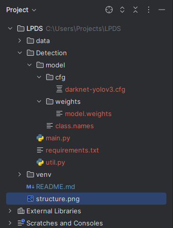

# Darknet-YOLOv3 License Plate Detection

## Project Overview
This project implements a license plate detection system using the Darknet-YOLOv3 model. The system detects and extracts license plates from vehicle images, utilizing advanced image processing techniques to achieve high accuracy and efficiency.

## Project Structure

The project directory is organized as follows:




## Set-Up
To set up the project, follow these steps:

Install the required Python packages:

````bash

pip install -r requirements.txt
````
## Download Model Weights

You can download the model.weights via this link:

```bash 
 https://drive.google.com/file/d/1vXjIoRWY0aIpYfhj3TnPUGdmJoHnWaOc/edit
````

## Usage

To run the license plate detection:

1. Ensure you have the Darknet-YOLOv3 model files (darknet-yolov3.cfg, model.weights, class.names) in the model directory.

2. Place your test images in the data directory.

3. Execute the main script: main.py

## Files Description

main.py: The main script to run the detection system.

util.py: Contains utility functions used in the project.

requirements.txt: Lists the required Python packages.

model/: Contains the YOLOv3 configuration, weights, and class names files.

data/: Directory to store test images.


## Dependencies

Python 3.6+

opencv-python==4.6.0.66

matplotlib==3.6.0

numpy==1.23.3

easyocr==1.6.2